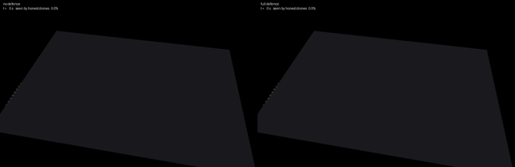
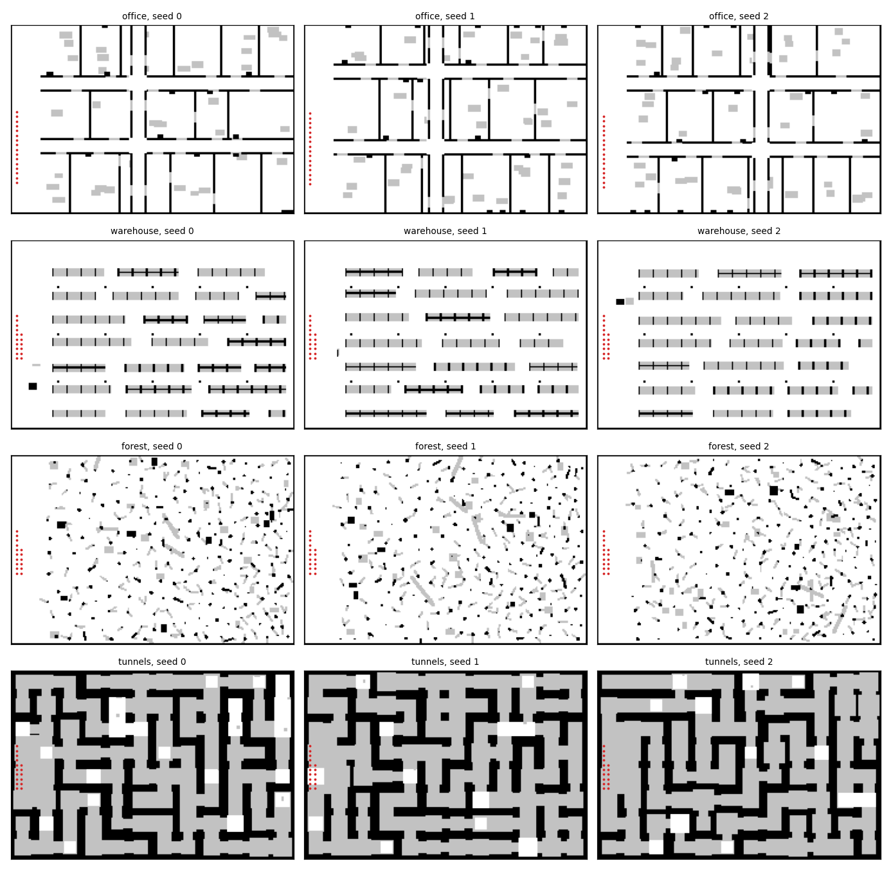
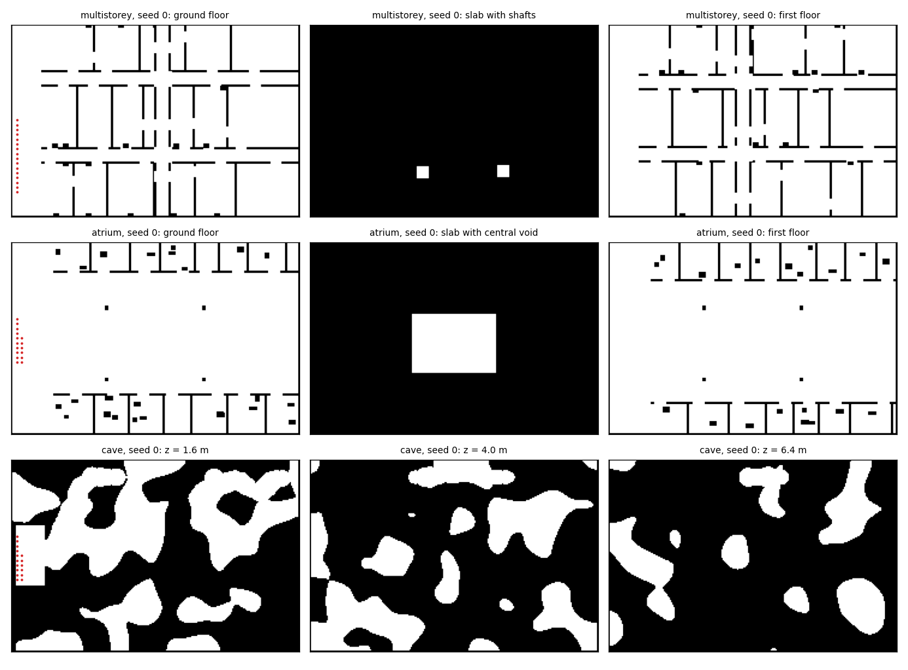
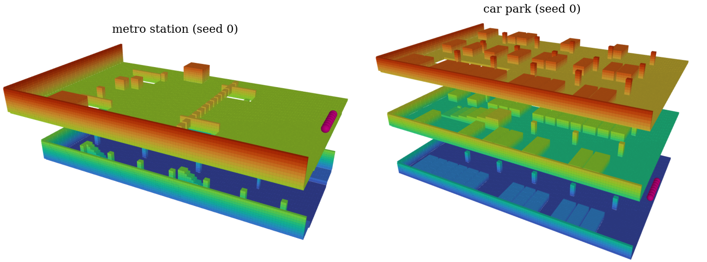
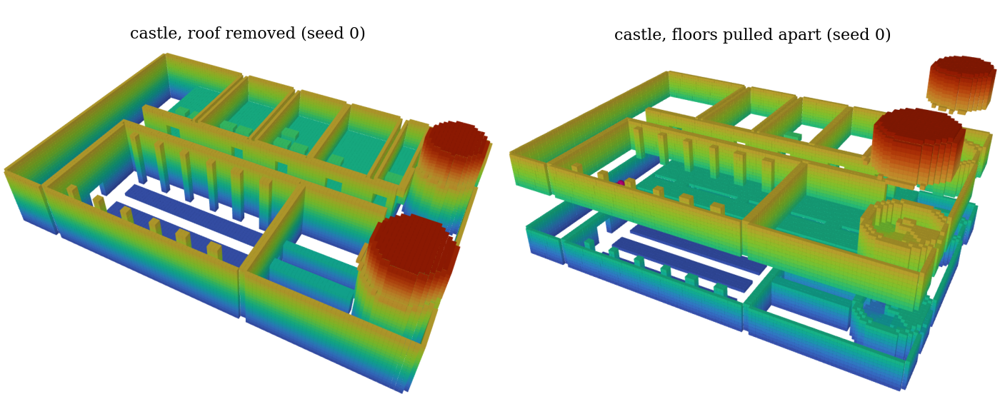
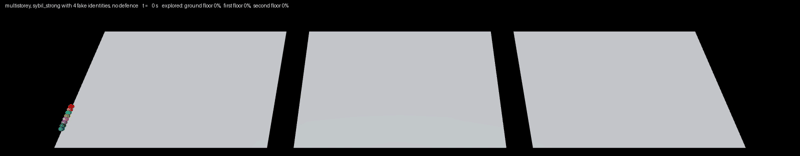
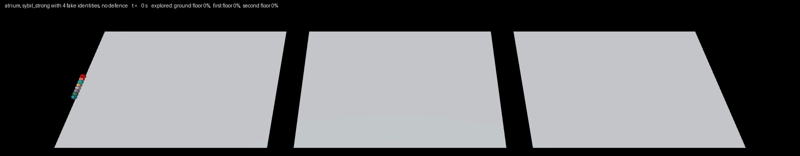
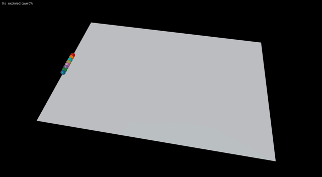

# Sybil attacks on multi-drone 3D mapping of indoor and confined spaces

A team of drones explores an unknown building, tunnel network, warehouse or forest and builds a
shared 3D voxel map. One compromised drone creates fake identities that fly, scan and claim
frontiers like real drones, so the rest of the team leaves the areas they "explored" untouched.
This repository simulates the team, the attack and defences that use only the drones' own
sensors.



*Office map, 8 drones, one of them compromised and running 4 fake identities at a time.
Red blocks are walls that do not exist. Left: no defence, the team stops with 60% of the office
seen. Right: full defence, fake identities are revoked and the attacker replaces them 9 times, 100% seen.
[Full video](media/sybil_demo.mp4)*

## What is simulated

**Worlds.** Four procedural families (office, warehouse, forest, tunnels; 48 × 32 m, 0.2 m
voxels, seeded).



**Drones.** Forward depth camera (90° × 60°, 6 m, range noise and dropouts) or a spinning lidar
(360° × 59°, 30 m), plus up and down range sensors. Each drone keeps its own log-odds voxel map,
picks frontiers by size per distance, plans on a 0.4 m grid with 0.4 m clearance, follows the
path with pure pursuit and brakes for obstacles in its map.

**Team.** Map updates are gossiped over a radio link that weakens through walls, with limited
bandwidth, packet loss and retransmission. Drones take off one after another and announce the
frontier they are heading for so the others spread out.

**Attacks.**

| | |
|---|---|
| `sybil_weak` | fake identities join at launch next to the attacker, fly openly, send careless scans |
| `sybil_strong` | identities join one by one, send consistent scans, build trust by relaying real data under their names, and are replaced when revoked |
| `sybil_stealth` | `sybil_strong`, but fake identities only claim positions no honest sensor can check |
| `sybil_targeted` | `sybil_strong`, but fake identities go to the frontiers with the most unexplored space behind them (shafts, doorways), claim them and report a wall across the opening |
| `sybil_shadow` | `sybil_targeted`, but each fake reports a position right next to a real drone, so a presence check finds a body there |
| `fakewall`, `fakefree` | a drone reports walls or free space that do not exist under its own name |
| `blackhole`, `greyhole` | a drone drops the map data it should relay |

**Defences.**

| level | adds |
|---|---|
| D0 | nothing |
| D1 | first-hand audit of received map data, Beta trust per identity, revocation and roll-back |
| D2 | only vouched identities can corroborate a claim; presence check (is there a drone where an identity says it is?) |
| D3 | trust requires being seen in person; wall claims judged separately; drones visit areas reported by identities they cannot vouch for |
| D4 | quarantine: map data and claims are used only from identities seen in person or vouched for by two drones that were |
| D5 | one body, one identity: each body a drone sees is bound to a single identity, other identities claiming it count as absent |
| signed | message signatures: fake identities are impossible |

## Install

```bash
pip install -r requirements.txt
python3 -m pytest -q tests
```

## Use

Watch a mission in 3D (macOS: `mjpython`, elsewhere `python3`). Left-drag rotates, right-drag
pans, scroll zooms.

```bash
mjpython scripts/view3d.py office 0                                   # 8 honest drones
mjpython scripts/view3d.py office 0 sybil_strong --fakes 4            # attack, no defence
mjpython scripts/view3d.py office 0 sybil_strong --fakes 4 --defence D3
mjpython scripts/view3d.py tunnels 3 sybil_weak --fakes 8 --sensor lidar
```

Map families, seeds 0-9 are the experiment maps:

```bash
mjpython scripts/show_world3d.py warehouse 3      # N / P: next / previous seed, F: next family
python3 scripts/show_worlds.py 0 9                # top views -> media/worlds_0-9.png
python3 scripts/show_worlds.py --extra            # multi-storey, atrium, cave -> media/worlds_extra.png
```

Experiments:

```bash
python3 scripts/calibrate_trust.py                          # honest contradiction rates on held-out maps
python3 scripts/run.py sybil --seeds 0 1 2 3 4 5 6 7 8 9    # one JSON per run in results/, resumable
python3 scripts/run.py bind                                  # shadow attack and D5 on the 40 maps
python3 scripts/run.py storey --families multistorey atrium cave   # targeted attack, multi-floor and cave worlds
python3 scripts/render3d.py office 0 sybil_strong 4 D0 D3
```

## Extending

Watch any setup in action:

```bash
mjpython scripts/view3d.py warehouse 2 sybil_strong --drones 12 --fakes 6 --defence D4 --speed 3
```

`--drones` is the team size, `--fakes` the number of fake identities active at a time,
`--defence` one of D0-D5, `--sensor` camera or lidar. The last drone of the team is the
compromised one.

For batches, add an experiment to `conditions()` in `scripts/run.py`. Each condition is
`(name, parameter overrides, attack)`, where the attack is `(name, compromised drones, settings)`
or `None`:

```python
if exp == "team":
    out = []
    for n in (4, 8, 12):
        out.append((f"n{n}-none-D0", dict(n_drones=n), None))
        for d in ("D0", "D4"):
            out.append((f"n{n}-strong4-{d}", dict(DEFENCES[d], n_drones=n),
                        ("sybil_strong", 1, dict(n_sybil=4))))
    out.append(("2att-strong6-D4", dict(D4), ("sybil_strong", 2, dict(n_sybil=6, spawn_every=2.0))))
    return out
```

```bash
python3 scripts/run.py team --families office warehouse --seeds 0 1 2
```

Results go to `results/team/`, one JSON per run, with the time series of every metric.

Team and environment (`Params` in `swarm/sim.py`):

| parameter | default | |
|---|---|---|
| `n_drones` | 8 | team size |
| `sensor` | `"camera"` | `"camera"` or `"lidar"` |
| `max_range`, `hfov`, `vfov` | 6 m, 90°, 60° | depth camera |
| `lidar_range` | 30 m | lidar |
| `v_max` | 1.5 m/s | flight speed |
| `comm_range` | 25 m | radio range |
| `loss` | 0 | packet loss rate |
| `t_max` | 600 s | mission length (set in `scripts/run.py`) |
| `claim_radius` | 6 m | frontier claim radius |

Attack settings (class attributes in `swarm/attacks.py`, passed as the third element of the
attack):

| setting | default | |
|---|---|---|
| `n_sybil` | 4 | fake identities active at a time |
| `speed` | 1.2 m/s | fake identity speed |
| `first_spawn` | 8 s | first fake identity (strong, stealth) |
| `spawn_every` | 4 s | gap between new identities (strong, stealth) |
| `relabel` | 0.8 | share of relayed real data sent under fake names (strong, stealth) |

Defence switches are in the same `Params` (`audit_vouched`, `presence`, `trust_needs_body`,
`trust_by_type`, `verify_free`, `quarantine`, `attest_quorum`, `bind`); D0-D5 in `scripts/run.py` are
combinations of them. A new attack is a subclass of `_Sybil` (or `Attacker`) in
`swarm/attacks.py` added to `ATTACKS`; for a Sybil variant, `_lengths` sets what each fake scan
reports. A new world family is a function in `swarm/worlds.py` added to `EXTRA_FAMILIES` and `make`.

## More worlds

Six more families need exploration in all three dimensions. The first three are in the results
below; `metro`, `carpark` and `castle` are new and have not been run yet.

| family | |
|---|---|
| `multistorey` | three office floors (9.6 m) joined by two 2 m shafts through each slab |
| `atrium` | three-level mall (10.8 m) with shops, balconies and an open central void |
| `cave` | natural 3D cave (8 m) around a winding main passage |
| `metro` | two-level metro station (10 m): ticket hall with a gate line above, two platforms and tracks below, joined only by four stairwells |
| `carpark` | three-level car park (9 m) with pillars and parked cars, floors joined by one ramp each |
| `castle` | castle wing (12 m): a double-height great hall with long tables and pillars, two levels of classrooms along a corridor, a round tower with a spiral staircase up to a tower room, and an open round tower |







Seeds 0-9 are the experiment maps and 100-104 are held out, as for the other families. Missions
last 1200 s in `multistorey`, `atrium`, `metro`, `carpark` and `castle` and 600 s in `cave`. To run the
targeted attack on the new ones:

```
python3 scripts/run.py storey --families metro carpark castle
```

Strong attack with 4 fake identities and no defence, the team's map floor by floor (red: walls that
do not exist):







In this multi-storey building the team still sees 98% of each floor, but every floor's map carries
fake walls: in large, well-connected buildings the attack mostly corrupts the map rather than
leaving space unexplored. Full videos: [multi-storey](media/multistorey0_sybil_strong4_D0.mp4),
[atrium](media/atrium0_sybil_strong4_D0.mp4), [cave](media/cave0_sybil_strong4_D0.mp4).

Watch or record a mission, as the whole building (see-through floors) or floor by floor:

```bash
mjpython scripts/view_floors.py multistorey 0 D0 5              # world, seed, defence, speed
mjpython scripts/view_floors.py atrium 0 D4 5 side
python3 scripts/render_floors.py multistorey 0 D0 2 stacked     # video -> media/
```

To run the study on them:

```bash
python3 scripts/show_worlds.py --extra                         # check the maps
mjpython scripts/show_world3d.py multistorey 0                  # in 3D (F: next family)
mjpython scripts/view3d.py atrium 0 sybil_strong --fakes 4 --defence D4

python3 scripts/calibrate_trust.py --families multistorey atrium cave
python3 scripts/run.py sybil --families multistorey --seeds 0 1 2 3 4 5 6 7 8 9
python3 scripts/run.py sybil --families atrium --seeds 0 1 2 3 4 5 6 7 8 9
python3 scripts/run.py sybil --families cave --seeds 0 1 2 3 4 5 6 7 8 9
python3 scripts/run.py storey --families multistorey atrium cave     # the runs in the table above
python3 scripts/tables.py --families multistorey atrium cave
```

The calibration runs honest teams on the held-out maps and prints the largest contradiction rate
of an honest drone; it must stay below the 2% trust tolerance (`trust_tol`), otherwise the audit
would accuse honest drones in these worlds. Each `run.py` command is one process with 36
conditions per map (360 missions per family) and skips missions already on disk, so the three
can run in parallel in separate terminals and be stopped and restarted. `tables.py` prints the
same tables as below for the new families.

## Layout

| path | |
|---|---|
| `swarm/worlds.py` | procedural worlds |
| `swarm/kernels.py` | ray casting, map fusion, planning grid, search, audit (Numba) |
| `swarm/sim.py` | drones, radio, coordination, defences, metrics |
| `swarm/attacks.py` | attackers |
| `swarm/scene3d.py`, `swarm/viz.py` | 3D and top-down views |
| `scripts/` | viewers, experiment runner, calibration, result tables, video |
| `tests/` | unit and integration tests |

## Results

40 maps (10 per family), 8 drones with one compromised, depth camera. "Explored" is
the share of the reachable space seen by the honest drones' own sensors (mean over maps); "false
cells" is the median number of cells per honest map that contradict the true world. Raw runs are
in `results/`.

Explored space without any defence, by number of fake identities:

| attack | 1 | 2 | 4 | 8 |
|---|---|---|---|---|
| weak | 92.7% | 87.0% | 81.3% | 75.1% |
| strong | 97.2% | 97.2% | 90.3% | 86.1% |
| stealth | 98.1% | 96.6% | 95.2% | 91.4% |

Without an attacker the team explores 99.8%.

Explored / false cells by defence level:

| attack | none | D3 | D4 |
|---|---|---|---|
| no attacker | 99.8% / 62 | 99.7% / 63 | 99.7% / 58 |
| weak, 8 identities | 75.1% / 30828 | 99.4% / 68 | 99.5% / 58 |
| strong, 8 identities | 86.1% / 26661 | 99.8% / 1618 | 99.5% / 64 |
| stealth, 8 identities | 91.4% / 24058 | 99.7% / 1373 | 99.8% / 61 |
| 2 compromised drones, 4 identities each | 76.3% / 35486 | 99.7% / 1831 | 99.7% / 1386 |

Time to 90% explored without an attacker: 134 s with no defence, 153 s with D3, 155 s with D4.

4 fake identities, explored / false cells by defence level:

| attack | none | D1 | D2 | D3 | D4 |
|---|---|---|---|---|---|
| weak | 81.3% / 24208 | 99.4% / 60 | 99.2% / 57 | 99.3% / 58 | 99.8% / 56 |
| strong | 90.3% / 18726 | 99.7% / 4776 | 99.9% / 3465 | 99.7% / 1816 | 99.7% / 61 |
| stealth | 95.2% / 16234 | 99.8% / 3002 | 99.7% / 3686 | 99.8% / 1143 | 99.8% / 63 |

Fakes parked next to real drones (`sybil_shadow`, 4 identities) and D5, 40 maps. Explored / false cells, and false cells in tunnels:

| attack | defence | explored / false cells | tunnels |
|---|---|---|---|
| none | D5 | 99.7% / 58 | 119 |
| shadow | none | 95.7% / 17098 | 139099 |
| shadow | D3 | 99.8% / 1782 | 42671 |
| shadow | D4 | 99.8% / 782 | 38528 |
| shadow | D5 | 99.8% / 57 | 111 |
| strong | D5 | 99.7% / 60 | 114 |
| stealth | D5 | 99.7% / 60 | 111 |
| targeted | D5 | 99.6% / 59 | 117 |

Multi-storey, atrium and cave (10 maps each, 4 identities). Explored (mean, worst map) / false cells:

| world | attack | none | D3 | D4 |
|---|---|---|---|---|
| multistorey | no attacker | 99.8% (99.1%) / 193 | | 99.8% (98.7%) / 178 |
| multistorey | strong | 85.5% (34.4%) / 44592 | | |
| multistorey | targeted | 82.3% (34.6%) / 72132 | 99.8% (99.0%) / 453 | 99.8% (98.8%) / 189 |
| atrium | no attacker | 99.8% (99.5%) / 166 | | 99.8% (99.2%) / 169 |
| atrium | strong | 94.1% (90.0%) / 45777 | | |
| atrium | targeted | 93.1% (85.3%) / 52756 | 99.7% (99.1%) / 2346 | 99.8% (99.6%) / 163 |
| cave | no attacker | 93.4% (70.0%) / 34 | | 93.4% (70.1%) / 38 |
| cave | strong | 82.9% (11.7%) / 257063 | | |
| cave | targeted | 86.5% (48.2%) / 347821 | 93.6% (70.2%) / 168751 | 93.4% (70.1%) / 45 |

Team size, strong attacker with 4 identities, explored / false cells:

| drones | no attacker | strong | strong, D4 | strong, D5 |
|---|---|---|---|---|
| 4 | 99.7% / 48 | 86.0% / 20632 | 99.6% / 43 | 99.6% / 43 |
| 8 | 99.8% / 62 | 90.3% / 18726 | 99.7% / 61 | 99.7% / 60 |
| 16 | 99.8% / 65 | 98.6% / 12413 | 99.8% / 121 | 99.7% / 61 |

Across all 2,260 runs, an honest drone was revoked by a teammate only twice, both in 16-drone teams and each time by a single drone (once by the D4 wall audit, once by a wrong D5 binding in a tunnel). On the held-out maps, honest contradiction rates remained very low: at most 0.04% (0.43% for wall claims alone), against a 2% threshold. Note that D4 cannot stop two colluding drones from vouching for each other’s fake identities for now.

## Contributing

Contributions are welcome. Please open an issue to report a bug or propose a new attack, defence
or world, and submit changes as a pull request. If you use this code in your research or work, please
cite this repository.

## License

MIT
