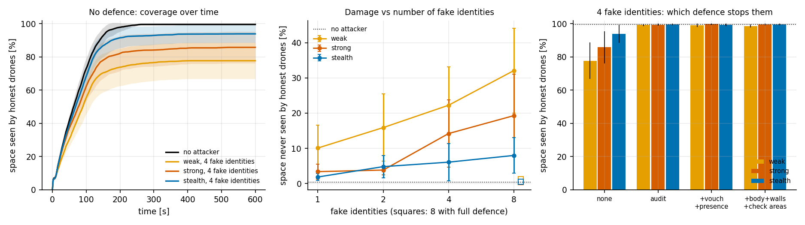

# Sybil attacks on multi-drone 3D mapping

A team of drones explores an unknown building, tunnel network, warehouse or forest and builds a
shared 3D voxel map. One compromised drone creates fake identities that fly, scan and claim
frontiers like real drones, so the rest of the team leaves the areas they "explored" untouched.
This repository simulates the team, the attack and defences that use only the drones' own
sensors.


*Office map, 8 drones, one of them compromised and running 4 fake identities at a time.
Red blocks are walls that do not exist. Left: no defence, the team stops with 60% of the office
seen. Right: full defence, 13 fake identities caught and replaced, 100% seen.
[Full video](media/sybil_demo.mp4)*

## What is simulated

**Worlds.** Four procedural families (office, warehouse, forest, tunnels; 48 × 32 m, 0.2 m
voxels, seeded).


**Drones.** Forward depth camera (90° × 60°, 6 m, range noise and dropouts) or a spinning lidar
(360° × 59°, 30 m), plus up and down range sensors. Each drone keeps its own log-odds voxel map,
picks frontiers by size per distance, plans on a 0.4 m grid with 0.4 m clearance, follows the
path with pure pursuit and brakes for obstacles in its map.

**Team.** Map updates are gossiped over a radio link that weakens through walls, with limited
bandwidth, packet loss and retransmission. Drones take off one after another and announce the
frontier they are heading for so the others spread out.

**Attacks.**

| | |
|---|---|
| `sybil_weak` | fake identities join at launch next to the attacker, fly openly, send careless scans |
| `sybil_strong` | identities join one by one, send consistent scans, build trust by relaying real data under their names, and are replaced when revoked |
| `sybil_stealth` | `sybil_strong`, but fake identities only claim positions no honest sensor can check |
| `fakewall`, `fakefree` | a drone reports walls or free space that do not exist under its own name |
| `blackhole`, `greyhole` | a drone drops the map data it should relay |

**Defences.**

| level | adds |
|---|---|
| D0 | nothing |
| D1 | first-hand audit of received map data, Beta trust per identity, revocation and roll-back |
| D2 | only vouched identities can corroborate a claim; presence check (is there a drone where an identity says it is?) |
| D3 | trust requires being seen in person; wall claims judged separately; drones visit areas reported by identities they cannot vouch for |
| D4 | quarantine: map data and claims are used only from identities seen in person or vouched for by two drones that were |
| signed | message signatures: fake identities are impossible |

## Install

```bash
pip install -r requirements.txt
python3 -m pytest -q tests
```

## Use

Watch a mission in 3D (macOS: `mjpython`, elsewhere `python3`). Left-drag rotates, right-drag
pans, scroll zooms.

```bash
mjpython scripts/view3d.py office 0                                   # 8 honest drones
mjpython scripts/view3d.py office 0 sybil_strong --fakes 4            # attack, no defence
mjpython scripts/view3d.py office 0 sybil_strong --fakes 4 --defence D3
mjpython scripts/view3d.py tunnels 3 sybil_weak --fakes 8 --sensor lidar
```

Map families, seeds 0-9 are the experiment maps:

```bash
mjpython scripts/show_world3d.py warehouse 3      # N / P: next / previous seed, F: next family
python3 scripts/show_worlds.py 0 9                # top views -> media/worlds_0-9.png
```

Experiments and figures:

```bash
python3 scripts/calibrate_trust.py                # honest contradiction rates on held-out maps
python3 scripts/run.py sybil --seeds 0 1 2 3 4    # one JSON per run in results/, resumable
python3 scripts/run.py sybil_lidar --seeds 0 1 2 3 4
python3 scripts/plot.py                           # media/fig_*.png, results/summary.md
python3 scripts/render3d.py office 0 sybil_strong 4 D0 D3
```

## Layout

| path | |
|---|---|
| `swarm/worlds.py` | procedural worlds |
| `swarm/kernels.py` | ray casting, map fusion, planning grid, search, audit (Numba) |
| `swarm/sim.py` | drones, radio, coordination, defences, metrics |
| `swarm/attacks.py` | attackers |
| `swarm/scene3d.py`, `swarm/viz.py` | 3D and top-down views |
| `scripts/` | viewers, experiment runner, calibration, figures, video |
| `tests/` | unit and integration tests |

## Results

20 maps (5 per family), 8 drones of which one is compromised, forward depth camera unless
stated. Coverage is the share of the reachable space the honest drones saw with their own
sensors. Raw runs are in `results/`, the full table in `results/summary.md`.



| | no defence | full defence (D3) |
|---|---|---|
| no attacker: coverage, time to 90% | 99.6%, 135 s | 99.4%, 161 s |
| weak, 8 fake identities | 67.9% | 98.8% |
| strong, 8 fake identities | 80.7% | 99.6% |
| stealth, 8 fake identities | 92.0% | 99.5% |
| two compromised drones, 4 fake identities each | 76.0% | 99.5% |

- Damage grows with the number of fake identities and is worst in offices and tunnels, where a
  few claimed rooms cut off whole wings (8 weak identities leave an office 37% seen).
- Every defence level restores coverage to 99-100%; fake identities are first caught after
  10-15 s and the strong attacker's replacement identities are caught as well. The higher levels
  mainly remove the false map data that is left behind.
- Hiding from honest sensors costs the attacker coverage damage but not map poisoning: the
  stealth attack leaves only 6-8% unexplored but plants the most false cells.
- With a 360° lidar the same strong attack leaves 2% unexplored instead of 14%, but the false
  cells are still accepted. In one lidar run, fake free space reported under a stealth identity
  led two honest drones into a low obstacle below the lidar's field of view.
- No honest drone was ever revoked. On held-out maps the worst honest contradiction rate is
  0.04% overall and 0.43% for walls, against a 2% threshold (`results/calibration_*.json`).

Runs on all 40 maps and with the quarantine defence (D4) are in progress.

## License

MIT
